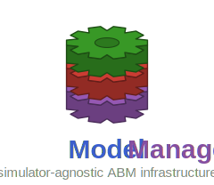

<p align="center"></p>

# ModelManager.jl

[](https://drbergman-lab.github.io/ModelManager.jl/stable/)
[](https://drbergman-lab.github.io/ModelManager.jl/dev/)
[](https://github.com/drbergman-lab/ModelManager.jl/actions/workflows/CI.yml?query=branch%3Amain)
[](https://codecov.io/gh/drbergman-lab/ModelManager.jl)

Simulator-agnostic infrastructure for agent-based model (ABM) management in Julia.

ModelManager provides the generic base layer for managing simulation runs, parameter variations, sensitivity analysis, and database bookkeeping. Simulator-specific packages (e.g. [PhysiCellModelManager.jl](https://github.com/drbergman-lab/PhysiCellModelManager.jl)) extend this package by implementing the `AbstractSimulator` interface.

## Quick start

ModelManager is not used directly by end users — use a concrete simulator package instead. If you are building a new simulator package on top of ModelManager:

1. Add the BergmanLabRegistry:
```julia-repl
pkg> registry add https://github.com/drbergman-lab/BergmanLabRegistry
```
2. Add ModelManager as a dependency:
```julia-repl
pkg> add ModelManager
```
3. Define your simulator:
```julia
using ModelManager

mutable struct MySimulator <: AbstractSimulator
    dir::String
    # ...simulator-specific fields
end
```
4. Implement the required interface methods (see `AbstractSimulator` docstring).
5. Set the global state in your package's `__init__`:
```julia
function __init__()
    ModelManager.mm_globals_ref[] = ModelManagerGlobals(simulator=MySimulator(...))
end
```

---

## Implementation Status

> For Claude Code sessions: this section is the authoritative record of what has been built. Update it as features are completed. See [PRD.md](PRD.md) for behavioral specifications and [progress.md](progress.md) for decision rationale.

### Completed

- [x] `AbstractSimulator` interface — extension point for simulator backends
- [x] `ModelManagerGlobals` — generic global state; simulator-specific fields moved to concrete simulators
- [x] Project configuration — `inputs.toml` parsing, `ProjectLocations`, location path utilities
- [x] Trial hierarchy — `Simulation`, `Monad`, `Sampling`, `Trial`, `InputFolders`, `VariationID`
- [x] Database schema — generic SQLite schema parameterized by simulator version table/column names
- [x] Database utilities — `queryToDataFrame`, `constructSelectQuery`, `buildWhereClause`, etc.
- [x] Schema migrations — `up.jl` framework with `upgradePackage`, `upgradeToMilestone`
- [x] Runner — parallel simulation execution via Julia tasks/channels; HPC SLURM support; `prepareTrialHierarchy` + `pendingSimulationSpecs` split
- [x] Deletion — `deleteSimulations`, `deleteMonad`, `deleteSampling`, `deleteTrial`, `resetDatabase`
- [x] Parameter variations — `XMLPath`, `DiscreteVariation`, `DistributedVariation`, `CoVariation`, `LatentVariation`
- [x] Space-filling designs — `GridVariation`, `LHSVariation`, `SobolVariation`, `RBDVariation`
- [x] Sensitivity analysis — MOAT, Sobol', RBD-FAST (generic, no simulator-specific logic)
- [x] Sensitivity visualization — `RecipesBase.jl` recipes for `MOATSampling` (`:bar` with optional σ whiskers, `:violin`, `:scatter` µ*–σ screening), `SobolSampling` (S1/ST grouped bars, `show_ST` toggle), and `RBDSampling` (first-order bars); one series per sensitivity function
- [x] `createTrial` / `run` user API — convenience wrappers over the trial hierarchy; `run(Ts::AbstractVector)` / `createTrial(::AbstractVector)` bundle a collection of pre-built trials into one `Trial` for a single batched run
- [x] Analysis tables — `simulationsTable` / `printSimulationsTable` (one row per simulation) and `monadsTable` / `printMonadsTable` (one row per monad); shared `remove_constants` / `sort_by` / `sort_ignore` / `short_names` kwargs
- [x] `postSimulationProcessing` / `postSimulationCleanup` interface stubs — simulators override for non-destructive processing (before the user hook) and destructive cleanup/pruning (after it), respectively
- [x] User post-processing hook — `run(T; post_processor=f)` runs `f(simulation_process)` after each successful sim (ordering: `postSimulationProcessing` → `post_processor` → `postSimulationCleanup`, so the callback sees the intact output folder); returning a `NamedTuple`/`Dict` of quantities upserts a row into the `data/outputs/postprocessing.db` sink (dynamic columns, one row per `simulation_id`); read back via `postProcessingTable` / `printPostProcessingTable`, or joined onto the simulations table with `simulationsTable(...; post_processing=true)`. Callback ergonomics: `simulationID`, `monadID`, `wasSuccessful`, and `pathToOutputFolder(simulation_process)` accessors so users avoid struct internals (simulator-specific output loading stays in the downstream package)
- [x] `initializeInputFolder` / `getInputFolderDescription` / `clearSimulatorArtifacts` interface stubs
- [x] `addVariationRows` interface stub — simulators implement DB writes for variation rows
- [x] HPC utilities — `isRunningOnHPC`, `setJobOptions`, `defaultJobOptions`
- [x] PCMM migration — PCMM wired to use `ModelManagerGlobals` and implement all `AbstractSimulator` methods
- [x] Calibration infrastructure — `CalibrationProblem`, `ABCSMC`, `runABC`, `resumeABC`, `mseDistance`, ABC-SMC core algorithm, generation persistence, `calibrations` DB table; migrated from PCMM
- [x] ABC-SMC enhancements — parallel batch evaluation, systematic resampling, ESS, acceptance-rate tracking, `ConvergenceSummary`, manual epsilon schedule, additional stopping criteria (`min_acceptance_rate`, `min_epsilon_decrease`, `min_ess_fraction`), `accept_overflow` mode, dual-CSV generation output, `CalibrationParameter` tagged-union display layer, JLD2 problem persistence, `resumeABC(Calibration(id))` with no re-supplied problem
- [x] Simulation bank — `SimulationBank`, `_buildSimulationBank`; pre-built CDF-space registry of existing monads for reuse in calibration; KD-tree (Chebyshev metric, `NearestNeighbors.jl`) for O(log n + k) L∞ box queries
- [x] CDF-grid snapping — `cdf_grid_k` on `ABCSMC`; lookup-first bank reuse + fallback snap to dyadic grid; generational grid refinement (`k_eff = k_base + t − 1`); per-generation monad-ID dedup ensures each monad runs at most once per generation
- [x] CDF-grid safeguards — automatic `k_base_eff` correction when `cdf_grid_k` is too coarse for `population_size` × parameter dimension; `max_evaluations` field caps total evaluated particles across the entire run
- [x] Kernel type hierarchy — `AbstractKernel` / `AbstractFittedKernel` two-level hierarchy; `GaussianKernel`, `ComponentwiseKernel`, `LocalNNKernel`, `LocalNNCovKernel`; dispatch-based `_fitKernel`, `_proposeParticle`, `_kernelDensity`; TOML serialization under `[perturbation_kernel]` subtable; generation-indexed scale via `_effectiveKernelScale`
- [x] Calibration progress reporting — `progress` keyword on `runABC`/`runCalibration`/`resumeABC` (`:auto`, `:none`, `:generation`, `:batch`, `:bar`); generation- and batch-start milestones plus a live per-simulation `ProgressMeter.jl` bar; driven by a generic `on_progress` hook on `run`; `:auto` resolves to `:bar` on a TTY and `:generation` otherwise
- [x] Posterior visualization — `RecipesBase.jl` recipes for `ABCResult`/`Calibration`: corner pairs plot (`:corner`), ridgeline posterior-narrowing plot (`:ridgeline`), convergence diagnostics plot (`:convergence`), and generation transition plot (`:transition`)
- [x] `LatentVariation` enhancements — `target_names` field for LVSource display column naming; `inverse_maps` auto-constructed for DV/CVSource, user-supplied for LVSource with `_validateInverseMaps` round-trip check at construction; `_validateStructuralMatch` extended to handle all source types including `LVSource`; scan-based `_loadGenerations` (padding-agnostic); `generation_cdfs/` directory stored as a subdirectory of `generations/`; `short_names=false` kwarg on `simulationsTable` for raw XML-path column names
- [x] `initializeModelManager` generic entry point — `initializeModelManager(::AbstractSimulator, data_dir)` with `centralDBFileName` and `postInitDisplay` extension points

### Remaining

- [ ] `createProject` generic entry point
- [ ] GP-accelerated ABC — `GPAcceleratedABC <: AbstractCalibrationMethod` using a surrogate to reduce simulator evaluations; `AbstractCalibrationMethod` hierarchy is already in place.
