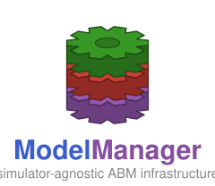

<p align="center"></p>

# ModelManager.jl

[](https://drbergman-lab.github.io/ModelManager.jl/stable/)
[](https://drbergman-lab.github.io/ModelManager.jl/dev/)
[](https://github.com/drbergman-lab/ModelManager.jl/actions/workflows/CI.yml?query=branch%3Amain)
[](https://codecov.io/gh/drbergman-lab/ModelManager.jl)

Simulator-agnostic infrastructure for agent-based model (ABM) management in Julia.

ModelManager provides the generic base layer for managing simulation runs, parameter variations, sensitivity analysis, and database bookkeeping. Simulator-specific packages (e.g. [PhysiCellModelManager.jl](https://github.com/drbergman-lab/PhysiCellModelManager.jl)) extend this package by implementing the `AbstractSimulator` interface.

## Quick start

ModelManager is not used directly by end users — use a concrete simulator package instead. If you are building a new simulator package on top of ModelManager:

1. Add the BergmanLabRegistry:
```julia-repl
pkg> registry add https://github.com/drbergman-lab/BergmanLabRegistry
```
2. Add ModelManager as a dependency:
```julia-repl
pkg> add ModelManager
```
3. Define your simulator:
```julia
using ModelManager

mutable struct MySimulator <: AbstractSimulator
    dir::String
    # ...simulator-specific fields
end
```
4. Implement the required interface methods (see `AbstractSimulator` docstring).
5. Set the global state in your package's `__init__`:
```julia
function __init__()
    ModelManager.mm_globals_ref[] = ModelManagerGlobals(simulator=MySimulator(...))
end
```

---

## Implementation Status

> For Claude Code sessions: this section is the authoritative record of what has been built. Update it as features are completed. See [PRD.md](PRD.md) for behavioral specifications and [progress.md](progress.md) for decision rationale.

### Completed

- [x] `AbstractSimulator` interface — extension point for simulator backends
- [x] `ModelManagerGlobals` — generic global state; simulator-specific fields moved to concrete simulators
- [x] Project configuration — `inputs.toml` parsing, `ProjectLocations`, location path utilities
- [x] Trial hierarchy — `Simulation`, `Monad`, `Sampling`, `Trial`, `InputFolders`, `VariationID`
- [x] Database schema — generic SQLite schema parameterized by simulator version table/column names
- [x] Database utilities — `queryToDataFrame`, `constructSelectQuery`, `buildWhereClause`, etc.
- [x] Schema migrations — `up.jl` framework with `upgradePackage`, `upgradeToMilestone`; migrations target the version loaded in the session, read from the package defining the simulator type, so updating the environment mid-session defers the schema change to the next session rather than recording a version whose migration never ran
- [x] Runner — parallel simulation execution via Julia tasks/channels; HPC SLURM support; `prepareTrialHierarchy` + `pendingSimulationSpecs` split
- [x] Deletion — `deleteSimulations`, `deleteMonad`, `deleteSampling`, `deleteTrial`, `resetDatabase`
- [x] Parameter variations — `XMLPath`, `DiscreteVariation`, `DistributedVariation`, `CoVariation`, `LatentVariation`
- [x] Space-filling designs — `GridVariation`, `LHSVariation`, `SobolVariation`, `RBDVariation`
- [x] Sensitivity analysis — MOAT, Sobol', RBD-FAST (generic, no simulator-specific logic)
- [x] Sensitivity visualization — `RecipesBase.jl` recipes for `MOATSampling` (`:bar` with optional σ whiskers, `:violin`, `:scatter` µ*–σ screening), `SobolSampling` (S1/ST grouped bars, `show_ST` toggle), and `RBDSampling` (first-order bars); one series per sensitivity function
- [x] `createTrial` / `run` user API — convenience wrappers over the trial hierarchy; `run(Ts::AbstractVector)` / `createTrial(::AbstractVector)` bundle a collection of pre-built trials into one `Trial` for a single batched run
- [x] Analysis tables — `simulationsTable` / `printSimulationsTable` (one row per simulation) and `monadsTable` / `printMonadsTable` (one row per monad); shared `remove_constants` / `sort_by` / `sort_ignore` / `short_names` kwargs
- [x] `postSimulationProcessing` / `postSimulationCleanup` interface stubs — simulators override for non-destructive processing (before the user hook) and destructive cleanup/pruning (after it), respectively
- [x] User post-processing hook — `run(T; post_processor=f)` runs `f(simulation_process)` after each successful sim (ordering: `postSimulationProcessing` → `post_processor` → `postSimulationCleanup`, so the callback sees the intact output folder); returning a `NamedTuple`/`Dict` of quantities upserts a row into the `data/outputs/postprocessing.db` sink (dynamic columns, one row per `simulation_id`); read back via `postProcessingTable` / `printPostProcessingTable`, or joined onto the simulations table with `simulationsTable(...; post_processing=true)`. Callback ergonomics: `simulationID`, `monadID`, `wasSuccessful`, and `pathToOutputFolder(simulation_process)` accessors so users avoid struct internals (simulator-specific output loading stays in the downstream package)
- [x] `initializeInputFolder` / `getInputFolderDescription` / `clearSimulatorArtifacts` interface stubs
- [x] HPC utilities — `isRunningOnHPC` (probed by `initializeModelManager`, so HPC mode turns itself on where SLURM exists), `useHPC`, `setJobOptions`, `defaultJobOptions`
- [x] HPC-safe removal — `rm_hpc_safe` tries the real `rm` first and stages only what a shared filesystem refuses to release into `data/.trash/`, returning `:removed`/`:staged`/`:unremoved` and warning once per project rather than throwing mid-deletion; `initializeModelManager` retries staged paths in the background and `databaseDiagnostics` reports whatever remains
- [x] PCMM migration — PCMM wired to use `ModelManagerGlobals` and implement all `AbstractSimulator` methods
- [x] Calibration infrastructure — `CalibrationProblem`, `ABCSMC`, `runABC`, `resumeABC`, `mseDistance`, ABC-SMC core algorithm, generation persistence, `calibrations` DB table; migrated from PCMM
- [x] ABC-SMC enhancements — parallel batch evaluation, systematic resampling, ESS, acceptance-rate tracking, `ConvergenceSummary`, manual epsilon schedule, additional stopping criteria (`min_acceptance_rate`, `min_epsilon_decrease`, `min_ess_fraction`), `accept_overflow` mode, dual-CSV generation output, `CalibrationParameter` tagged-union display layer, JLD2 problem persistence, `resumeABC(Calibration(id))` with no re-supplied problem
- [x] Simulation bank — `SimulationBank`, `_buildSimulationBank`; pre-built CDF-space registry of existing monads for reuse in calibration; KD-tree (Chebyshev metric, `NearestNeighbors.jl`) for O(log n + k) L∞ box queries
- [x] CDF-grid snapping — `cdf_grid_k` on `ABCSMC`; lookup-first bank reuse + fallback snap to dyadic grid; generational grid refinement (`k_eff = k_base + t − 1`); per-generation monad-ID dedup ensures each monad runs at most once per generation
- [x] CDF-grid safeguards — automatic `k_base_eff` correction when `cdf_grid_k` is too coarse for `population_size` × parameter dimension; `max_evaluations` field caps total evaluated particles across the entire run
- [x] Kernel type hierarchy — `AbstractKernel` / `AbstractFittedKernel` two-level hierarchy; `GaussianKernel`, `ComponentwiseKernel`, `LocalNNKernel`, `LocalNNCovKernel`; dispatch-based `_fitKernel`, `_proposeParticle`, `_kernelDensity`; TOML serialization under `[perturbation_kernel]` subtable; generation-indexed scale via `_effectiveKernelScale`
- [x] Calibration progress reporting — `progress` keyword on `runABC`/`runCalibration`/`resumeABC` (`:auto`, `:none`, `:generation`, `:batch`, `:bar`); generation- and batch-start milestones plus a live per-simulation `ProgressMeter.jl` bar; driven by a generic `on_progress` hook on `run`; `:auto` resolves to `:bar` on a TTY and `:generation` otherwise
- [x] Posterior visualization — `RecipesBase.jl` recipes for `ABCResult`/`Calibration`: corner pairs plot (`:corner`), ridgeline posterior-narrowing plot (`:ridgeline`), convergence diagnostics plot (`:convergence`), and generation transition plot (`:transition`)
- [x] Simulation-failure handling in calibration — failed simulation IDs and the monads they belong to are recorded per generation (`generation_{NNN}_failed_simulations.csv`, `generation_{NNN}_failed_monads.csv`) with one warning per generation; a monad left with no successful simulation is detected before user code runs and its distance recorded as `missing` (never a sentinel value), either rejecting the particle or failing the run, via the `on_monad_failure` keyword on `runABC`/`runCalibration`/`resumeABC` (`:reject` default, `:error`); partially failed monads are evaluated from what succeeded (no top-off re-runs); `summary_statistic`/`distance` failures on a healthy monad — including a non-`Real` distance — are always fatal with the monad named; generation 1 drops `missing` particles before setting ε, and errors if no monad succeeded or if ε would be non-finite; `SimulationBank` admission (at load time and mid-run) requires at least one `Running`/`Completed` simulation, which keeps deleted and never-started monads out of the bank
- [x] `LatentVariation` enhancements — `target_names` field for LVSource display column naming; `inverse_maps` auto-constructed for DV/CVSource, user-supplied for LVSource with `_validateInverseMaps` round-trip check at construction; `_validateStructuralMatch` extended to handle all source types including `LVSource`; scan-based `_loadGenerations` (padding-agnostic); `generation_cdfs/` directory stored as a subdirectory of `generations/`; `short_names=false` kwarg on `simulationsTable` for raw XML-path column names
- [x] `initializeModelManager` generic entry point — `initializeModelManager(::AbstractSimulator, data_dir)` with `centralDBFileName` and `postInitDisplay` extension points
- [x] Trial tagging and feature-based recovery — polymorphic `tags` table (key/value, multi-valued, `UNIQUE` across the value) keyed by `(trial_class, trial_id)`; `tag!` / `untag!` / `tags` / `hasTag` accept objects, type+IDs, object vectors, bare ID vectors, or an `MMOutput`, so tagging works retroactively on query results as well as up front; a `tags=` keyword on `createTrial`/`run` applies tags to the object returned (or, for a batched `run(Ts)`, to each trial handed in) — tags travel in the call, so there is no ambient state and parallel creation cannot mis-attribute them; automatic `mm:`-namespaced provenance (`mm:created`, `mm:session`, `mm:script`, `mm:git`, `mm:git.branch`, `mm:git.dirty`, plus `mm:method` from GSA and `mm:calibration`/`mm:generation` from ABC-SMC) that makes recovery work with zero user upkeep, stored as `datetime`/`provenance_id` columns on the trial tables plus a shared `provenances` row so the cost is ~21 bytes per object (~21 MB at 10⁶ simulations, measured, against 1.14 GB for one tag row per fact) while `tags`/`findTrials`/`tagsTable` still present the individual `mm:` keys; script and git state read via `LibGit2` at each `createTrial`/`run` call, so mid-session edits and successive `include`s are attributed correctly; keys are validated identifiers (`[a-z0-9][a-z0-9_.-]*`, lowercased) while values stay free-form, which makes the `mm:` namespace unforgeable through the public API; retrieval via `findSimulationIDs` / `findSimulations` / `findMonads` / `findTrials` with AND (`tags`) and OR (`any_of`) composition, `status` filtering, and query-time downward inheritance (`inherit=true`) so a tag on a `Sampling` never goes stale as replicates are added; object-returning finders build in a single query via `simulationsFromIDs` and refuse result sets above `MAX_MATERIALIZED_TRIALS` (overridable with `limit`), since an inherited trial-level tag can legitimately match every simulation in the project; `simulationsTable(...; tags=true)` pivots tags into namespaced `tag:<key>` columns; `tagsTable` / `tagKeys` / `tagValues` / `recommendedTagKeys` for vocabulary discovery; tag rows cleaned up at all four deletion choke points with `orphanedTagCounts` surfaced by `databaseDiagnostics`; new tables and columns are added idempotently from `createSchema` (guarded by `columnsExist`), so existing databases gain them with **no migration milestone** and simulator packages implement nothing

- [x] Symmetric trial-ID accessors — `simulationIDs` / `monadIDs` / `constituentIDs` / `trialID` / `trialType` / `length` / `trialFolder` all accept every level of the hierarchy plus the `MMOutput` that `run` returns (`constituentIDs` excepted for a `Simulation`, which has no constituents), and `monadIDs` additionally accepts a `Simulation` and a `GSASampling` — which is what makes `monadsTable(simulation)` and `monadsTable([simulation, monad])` honor the "any `AbstractTrial`" contract. `monadIDs(simulation)` resolves the monad for that simulation's parameterization by a pure `SELECT` against the `UNIQUE` key tuple `monads` shares with `simulations`, built by the shared `_monadKeyStrings` so accessor and constructor cannot drift; the version component is read from the simulation's own row rather than `currentSimulatorVersionID()`, so a simulator upgrade inside a project does not orphan simulations whose monads already exist. Going through `Monad(simulation)` would have created the row. Matching is on parameterization, not membership — documented, since a simulation from `Simulation(monad)` resolves to a monad that does not list it. `trialID(::Vector{Sampling})` is likewise a pure lookup returning `missing` on no match; find-or-create moved to the internal `_findOrCreateTrialID` that the `Trial(Ss)` constructor calls. **Breaking** (`0.9.0`): `trialID(::Vector{Sampling})` no longer creates a trial. Non-mutation is pinned by row-count assertions for both accessors, and the version behavior by a test that bumps the project's simulator version
- [x] Calibration runs as coalesced `Sampling` views, and a taggable `Calibration` — `Sampling(calibration)` and `Sampling(calibration, generation)` coalesce the monads a run evaluated into addressable samplings, plus `monadIDs`/`simulationIDs` accessors that read without recording anything (materializing a view mid-run would pin a partial monad set, since sampling identity is the exact set). `Calibration` is deliberately **not** inserted into the containment hierarchy and is not an `AbstractTrial`: containment runs batch → generation → calibration and those groupings overlap, which a strict chain cannot express — the views are legal only because every calibration monad shares the problem's input folders, which is what defines a `Sampling`. Brought into the tag subsystem as a fifth `TAG_CLASSES` member via per-type methods (`AbstractTaggable` considered and rejected), which required moving `include("tags.jl")` to the bottom of `src/ModelManager.jl` so its signatures can name any type in the package — now a standing rule, marked with a `#!` at the include site. Calibration-class tags do not inherit downward in v1; the `mm:calibration` batch tags remain the route to a run's monads, while a tag on the run itself is the durable one, since the `calibrations` row outlives any monad cascade. Adds `provenance_id` to `calibrationsSchema()` and `Calibration` to `ensureProvenanceColumns` (additive and idempotent, so **no migration milestone** and simulator packages implement nothing), `mm:method` on the run mirroring GSA, and the first read path against the `calibrations` table — `calibrationsTable`/`printCalibrationsTable`, `show(::Calibration)`, and a conservative `deleteCalibration` (`delete_subs=false`, since monads are shared through the bank and `use_previous`). Fixes `calibrationMonadIDs`, which matched `generation_{NNN}_failed_monads.csv` as well (folding deleted monads into the evaluated list), did not dedupe, and sorted generation names lexicographically
- [x] Portable docstring cross-references — docstrings `@ref` only *public* bindings (exported, or declared `@compat public`), so they resolve in downstream docs builds that render only ModelManager's public API; previously an `@ref` to an internal terminated PhysiCellModelManager's `makedocs` with a `:cross_references` error. The `AbstractSimulator` interface methods, `SimulationSpec`/`SimulationProcess`, `GSASampling`, and `simulationsTableFromQuery`/`monadsTableFromQuery` are declared public (unexported but part of the API); references to true internals are plain code spans. Enforced by the `"docstrings only @ref public bindings"` testset, which runs with the ordinary test suite and needs no docs build. See the "Docstring Cross-References" section of [CLAUDE.md](CLAUDE.md)

### Remaining

- [ ] `createProject` generic entry point
- [ ] GP-accelerated ABC — `GPAcceleratedABC <: AbstractCalibrationMethod` using a surrogate to reduce simulator evaluations; `AbstractCalibrationMethod` hierarchy is already in place.
